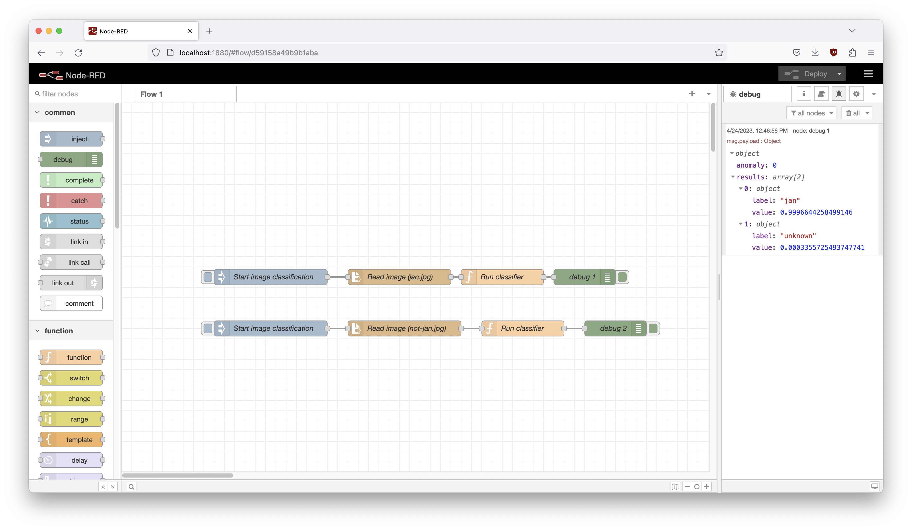

# Edge Impulse x Node-RED example

This is an example that shows how you can integrate models trained in [Edge Impulse](https://edgeimpulse.com) in a Node-RED project.

## How to run the example

1. Build and start the container:

    ```
    docker build -t honeywell-nodered .
    docker run --rm -it -p 1880:1880 -v $PWD/data:/data -v honeywell_node_modules:/data/node_modules --name honeywell honeywell-nodered
    ```

2. Open Node-RED at http://localhost:1880
3. There are two flows, one to classify [data/images/jan.jpg](data/images/jan.jpg) and one to classify [data/images/not-jan.jpg](data/images/not-jan.jpg):

    

    *Classifying an image correctly as 'jan'*

## Updating the model

To swap out for a new model:

1. Export your project as WebAssembly (from the **Deployment** page in your Edge Impulse project).
2. Swap out the `edge-impulse-standalone.js` and `edge-impulse-standalone.wasm` files in `data/model` for the ones from the WebAssembly export.

## Classifying non-images

The 'Run classifier' block classifies images via:

```
let result = await classifier.classifyImage(msg.payload);
msg.payload = result;
```

This actually resizes the image as it comes in to the correct size and pulls out the pixels in the image. If you have non-image data then pass in an array of numbers instead (input features) and then call:

```
let result = await classifier.classify(msg.payload);
msg.payload = result;
```
